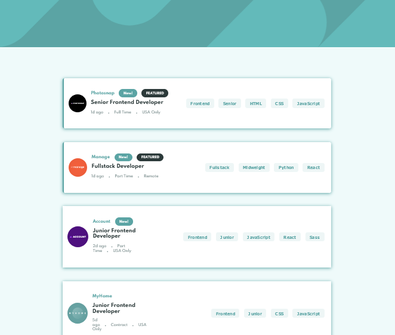
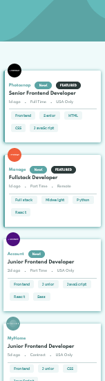

# Frontend Mentor - Job listings with filtering

## Welcome! 👋

Thanks for checking out this front-end coding challenge.

[Frontend Mentor](https://www.frontendmentor.io) challenges help you improve your coding skills by building realistic projects.

## Table of contents

- [Overview](#overview)
  - [The challenge](#the-challenge)
  - [Screenshot](#screenshot)
  - [Links](#links)
- [My process](#my-process)
  - [Built with](#built-with)
  - [What I learned](#what-i-learned)
  - [Continued development](#continued-development)
  - [Useful resources](#useful-resources)
- [Author](#author)
- [Acknowledgments](#acknowledgments)

## Overview

### The challenge

Users should be able to:

- View the optimal layout for the section depending on their device's screen size

### Screenshot

#### Desktop

#### Mobile

### Links

- Solution URL: [Github repo](https://github.com/edgarfb/static-job-listings)
- Live Site URL: [Calculator App](https://edgar-static-job-listings.netlify.app/)

## My process

### Built with

- React
- CSS Module
- Flexbox
- Mobile-first workflow
- Deploy on Netlify

### What I learned

I'm continuous learning React, digging a little more every day. This time I used React.useEffect to filter and manage the state.

### Continued development

Next I want to make some app that consume an API and I want to explore about Nextjs.

### Useful resources

- [React](https://reactjs.org/)
- [create-react-app](https://create-react-app.dev/)

## Author

- [Website](https://www.edgarbritez.com/)
- [Github](https://github.com/edgarfb)
- [Frontend Mentor](https://www.frontendmentor.io/profile/edgarfb)
- [Twitter](https://www.twitter.com/edgarfb_ok)

## Acknowledgments

I really enjoined and I learned a lot about layout whith the content of [Kevin Powell](https://www.kevinpowell.co/).\
You guys can enroll on [this course](https://courses.kevinpowell.co/conquering-responsive-layouts) totaly free.

